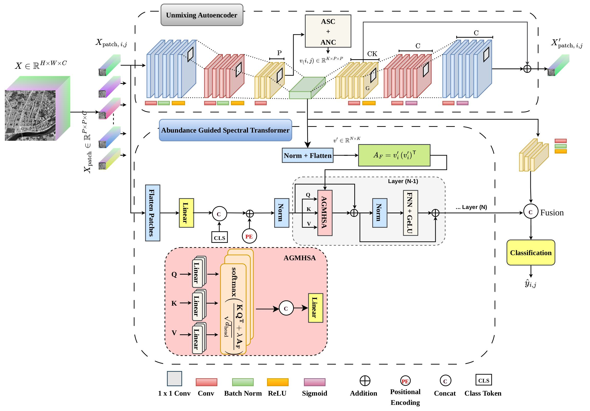

# AGSA-Net [IEEE TGRS 2026]

This is the official PyTorch Implementation of AGSA-Net (AGSA-Net: Abundance-Guided Self-Attention Network for Spectral Unmixing-Aware Hyperspectral Remote Sensing Image Classification) ([IEEE TGRS Paper](https://ieeexplore.ieee.org/document/11675920)) by
Nafisa Anjum, Satavisa Dey Borno, Ananna Saha, Mir Faiyaz Hossain, Sifat Momen, Nabeel Mohammed and Shafin Rahman.

[arXiv](https://arxiv.org/pdf/2609.06359)

## Overview

AGSA-Net is an abundance-guided self-attention framework for hyperspectral remote sensing image classification. The proposed model leverage **spectral unmixing** to estimate physically meaningful abundance maps, which represent the material composition of each pixel. These abundance maps are used to guide a **self-attention transformer**, allowing the network to focus on **class-discriminative spectral interactions** and long-range dependencies.

<p align="center">
  
</p>
<p align="center">
  <small><em>Figure: Architecture of the proposed Abundance-Guided Self-Attention Network (AGSA-Net) for spectral unmixing-aware hyperspectral image classification.</em></small>
</p>


The network first estimates physically meaningful abundance maps under non-negativity and sum-to-one constraints. These maps are refined using a hybrid linear–nonlinear reconstruction decoder and used to build an abundance affinity prior. This prior guides the spectral self-attention transformer to focus on class-discriminative spectral interactions. Finally, transformer features are fused with compact abundance descriptors for classification, combining spectral unmixing insights with self-attention modeling.


## Directory Structure

```text
├── data/
|  ├── IndianPine.mat                 
|  ├── Augburg/           
|  ├── Berlin/   
├── result/               # Trained model
├── output/               # generated outputs
├── dataset.py
├── main.py
├── metrics.py
├── model.py
├── train.py
├── utils.py
```

All quantitative and qualitative outputs are **automatically created when the code is executed**.

The results reported in the manuscript were obtained by running this implementation under the experimental settings described in the paper.

## Dataset

The adopted Augsburg and Berlin datasets can be downloaded from (https://pan.baidu.com/s/1fOzt4CJ0FQwDjGSP3DOU9w?pwd=c258) (code: c258).

## Run

### Train
Main command to train the model on a specified dataset. Dataset and patch size can be changed via `--dataset` and `--patches`.

```bash
python main.py --dataset Indian --flag_test train --patches 7
```

### Test 
Command to evaluate the trained model on a specified dataset. Saved model needs to be loaded before testing.

```bash
python main.py --dataset Indian --flag_test test --patches 7
```
## Acknowledgement

Part of this code is based on the implementation of [DSNet](https://github.com/hanzhu97702/DSNet). Many thanks to the authors for their valuable work.
