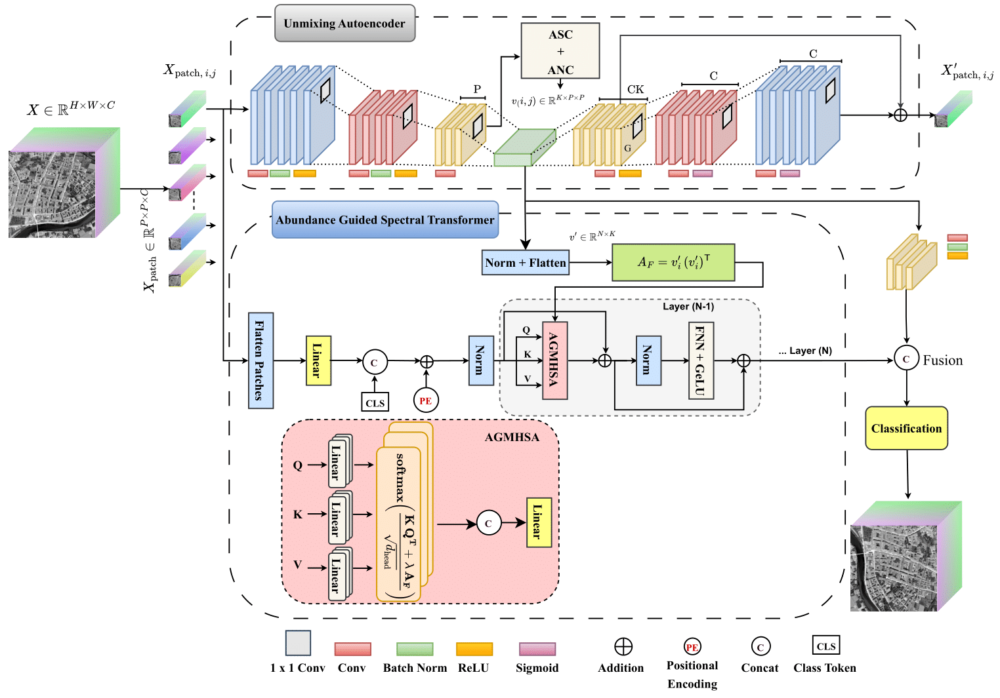

# AGSA-Net

## Overview

AGSA-Net is an abundance-guided self-attention framework for hyperspectral remote sensing image classification. The proposed model leverage **spectral unmixing** to estimate physically meaningful abundance maps, which represent the material composition of each pixel. These abundance maps are used to guide a **self-attention transformer**, allowing the network to focus on **class-discriminative spectral interactions** and long-range dependencies.

<p align="center">
  
</p>
**Figure:** Architecture of the proposed Abundance-Guided Self-Attention Network (AGSA-Net) for spectral unmixing-aware hyperspectral image classification.

The network first estimates physically meaningful abundance maps under non-negativity and sum-to-one constraints. These maps are refined using a hybrid linear–nonlinear reconstruction decoder and used to build an abundance affinity prior. This prior guides the spectral self-attention transformer to focus on class-discriminative spectral interactions. Finally, transformer features are fused with compact abundance descriptors for classification, combining spectral unmixing insights with self-attention modeling.


## Directory Structure

```text
├── data/
|  ├── IndianPine.mat                 
|  ├── Augburg/           
|  ├── Berlin/   
├── result/               # Trained model
├── output/               # generated outputs
├── dataset.py
├── main.py
├── metrics.py
├── model.py
├── train.py
├── utils.py
```

All quantitative and qualitative outputs are **automatically created when the code is executed**.

The results reported in the manuscript were obtained by running this implementation under the experimental settings described in the paper.

## Dataset

The adopted Berlin and Augsburg datasets can be downloaded from (https://pan.baidu.com/s/1fOzt4CJ0FQwDjGSP3DOU9w?pwd=c258) (the extracted code is c258).

## Run

### Train

```bash
python main.py --dataset Indian --flag_test train 
```

### test 

```bash
python main.py --dataset Indian --flag_test test 
```
## Acknowledgement

Part of this code is based on the implementation of [DSNet](https://github.com/hanzhu97702/DSNet); many thanks to the authors for their valuable work.